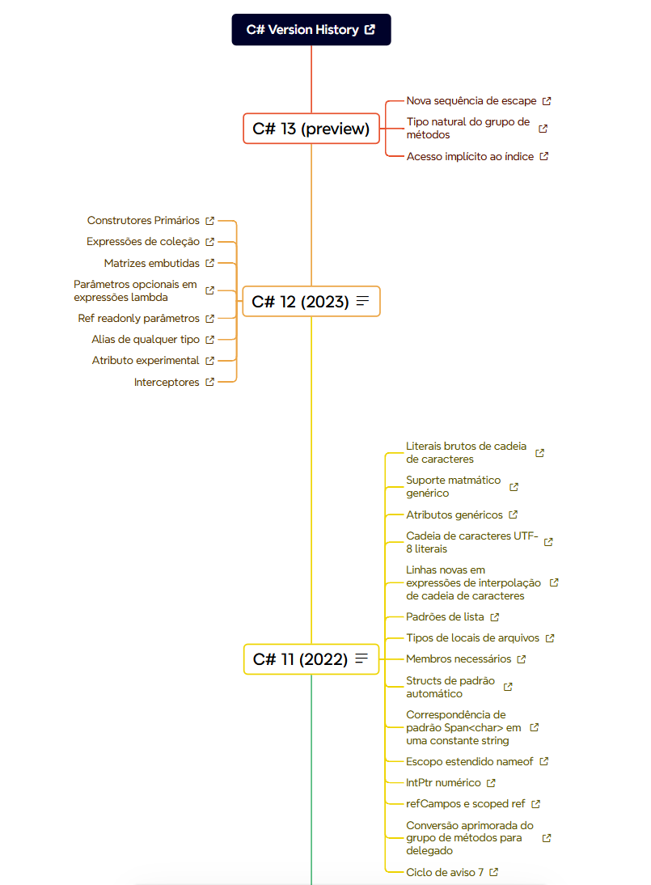

# CSHARP HISTORY

Abaixo você vai encontrar uma timeline com todas as versões do csharp e ano de lançamento, todas as features que foram disponibilidadas e um link de referência com a documentação oficial da microsoft por feature.

## Objetivo

> O objetivo desta timeline é dar a você uma ideia sobre a evolução da linguaguem, quais são as features e melhorias por versão e facilitar o acesso a uma documentação oficial e confiavél.

## Como navegar

Você pode acessar o mapa mental através do link: [csharp-history](https://xmind.ai/share/7VhTtyLx?xid=o7d6pfp1) o mapa é uma timeline segregada por versão e em cada versão temos as suas features, cada feature é um link para a documentação oficial microsoft do recurso.

### preview

## Give a Star! :star:

Esse material te ajudou de alguma forma?
De uma estrela para que eu possa saber e continuar a evoluí-lo

## Créditos

Créditos para o time da microsoft, toda a timeline foi montada baseado na documentação oficial, deste [link](https://learn.microsoft.com/pt-br/dotnet/csharp/whats-new/csharp-version-history#c-version-80)
